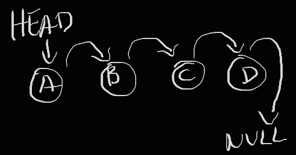
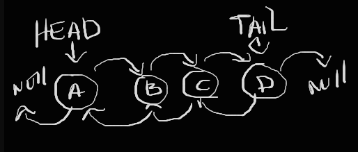
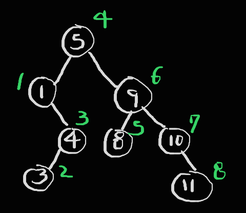
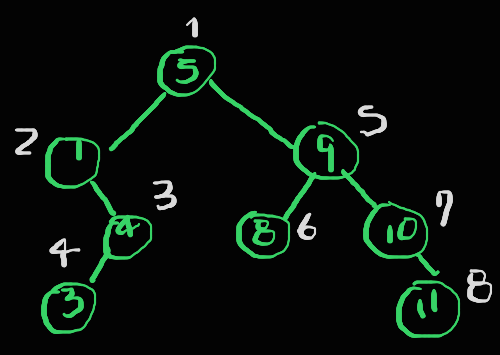
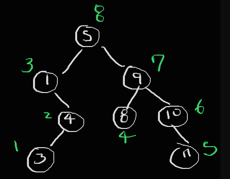

# Estructuras de datos en JavaScript

La estructuras de datos sirven para guardar información. En JS casi todo es un objecto (entidad abstracta que representa cualquier cosa) a excepción de los tipos primitivos: string, number, bigint, boolean, undefined y symbol. Con los objectos, _los valores se pasan por referencia_, esto quiere decir que si se modifica el objecto original o su copia esto afectará los valores de ambos. Diferente es el comportamiento de los primitivos que solo se pasa el valor y no su referencia.

## Clases

Son un "molde" para crear objetos.

- **Constructor**: método que se invoca al momento de crear un objecto
- **Super**: palabra clave para invocar al constructor de la clase padre
- **Herencia**: en la programación POO es cuando se heredan propiedades y métodos de otras clases, para expandir y reutilizar funcionalidades

## Programación funcional

JS permite el paradigma de la programación funcional, que se basa solo en funciones, aunque no al 100%. En JS existen varios métodos mutables e inmutables (algo que no se modifica/edita). Por ejemplo, _push_ de los arrays en un método mutable ya que altera el original pero _filter_ o _map_ son inmutables, devuelve un nuevo array y no cambian el original.

Una IIFE es una función que se ejecuta inmediatamente una vez que se a creado.

```js
(function () {
  ...
})()
```

- **Función de primera clase**: cualquier función que se puede guardar en una variable
- **Función de orden superior**: los parámetros que recibe son otras funciones
- **Función anónima**: que no tiene nombre

## Stack (pila)

Estructura de datos lineal basada en el principio _LIFO (Last In, First Out)_ donde el último elemento que entra, es el primero en salir. Conmunmente cuenta con 2 operaciones:

- **Push (apilar)**: se agrega un elemento al tope de la pila
- **Pop (desapilar)**: elimina el elemento que está en el tope de la pila

## Queue (cola)

Basado en la estructura de datos _FIFO (First In, First Out)_ donde el primero que entra, es el primero que sale.

## Linked List (lista enlazada)

Conjunto de nodos que estan enlazados mediante punteros donde cada elemento de la lista contiene un valor y una referencia al elemento siguiente. Nos permite representan una colección sin necesidad que sea un array y está formada por 3 elementos:

- **Head**: indica cual es el primer elemento
- **Nodo**: elementos enlazados que mantiene una referencia al siguiente nodo
- **Null**: indica el fin de la lista



## Doubly Linked List (DLL)

A diferencia de la lista simple, sus nodos tienen un puntero al nodo anterior y al siguiente, lo que permite una mejor flexibilidad en las operaciones de inserción y eliminación de nodos. También, permite guardar de forma no secuencial, conmunmente utilizados en sistemas distribuidos.



## Árbol Binario

Se conforma de una raíz que es un nodo el cual tiene 2 "hijos", uno a su derecha y el otro a la izquiera, a su vez cada hijo puede volver a tener otros 2 hijos. La necesidad de creación de estos árboles es para la optimización, por ejemplo, para las búsquedas de información en una base de datos. Pero su desventaja es al momento de _insertar_ información siendo una operación más lenta.

- **Recursividad**: función que se llama así misma

- **In Order**: primero se recorre el lado izquiero del árbol, luego se visita el nodo raíz y finalmente se recorre el lado derecho



- **Pre Order**: es hacer una acción (por ejemplo: mostrar en pantalla, guardar en una base de datos, etc) sobre el nodo raíz y luego sobre sus hijos, primero por la izquierda y después la derecha de manera recursiva



- **Post Order**: es lo inverso a Pre Order, primero se evaluan los hijos del nodo actual (partiendo por el que se encuentra más a la izquierda) y luego vuelve a evaluar al nodo raíz


